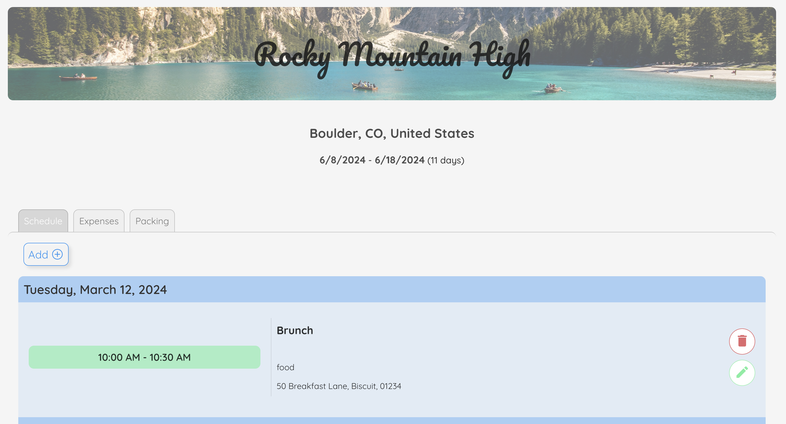

## Waypoint

### [Go to Waypoint]()

Organizing for trips can be a pain. Waypoint is a trip planning app that makes it painless.

### ✨ Features

- Track your schedule, expenses and packing list for a trip
- Each resource has full CRUD
- Streamlined, sleek UI

### 🧑‍💻 Technical Requirements:

- React
- HTML
- CSS
- JavaScript
- Node
- Express
- Mongoose
- MongoDB
- JWT Authentication
- Git/Github

### 🙏 Attributions: 

1. [Desert road image](https://unsplash.com/photos/yellow-volkswagen-van-on-road-A5rCN8626Ck) by [Dino Reichmuth](https://unsplash.com/@dinoreichmuth)
2. [Map image](https://unsplash.com/photos/white-and-green-state-maps-AFB6S2kibuk) by [Annie Spratt](https://unsplash.com/@anniespratt)
3. [Boats in water image](https://unsplash.com/photos/three-brown-wooden-boat-on-blue-lake-water-taken-at-daytime-T7K4aEPoGGk) by [Pietro De Grandi](https://unsplash.com/@peter_mc_greats)
4. [Road image](https://unsplash.com/photos/concrete-rail-road-ZRsJmpt9pNI) by [Luke Stackpoole](https://unsplash.com/@withluke)
5. [Desk image](https://unsplash.com/photos/black-camera-with-black-eyeglassse--WW8jBak7bo) by [Andyone](https://unsplash.com/@andyoneru)

### 🧊 Icebox: 
- Add ability to add reciept image to an expense
- Add ability for a user to create a more advanced profile
- Add splitting ability for expenses
- Add places to store important info like booking numbers, etc.